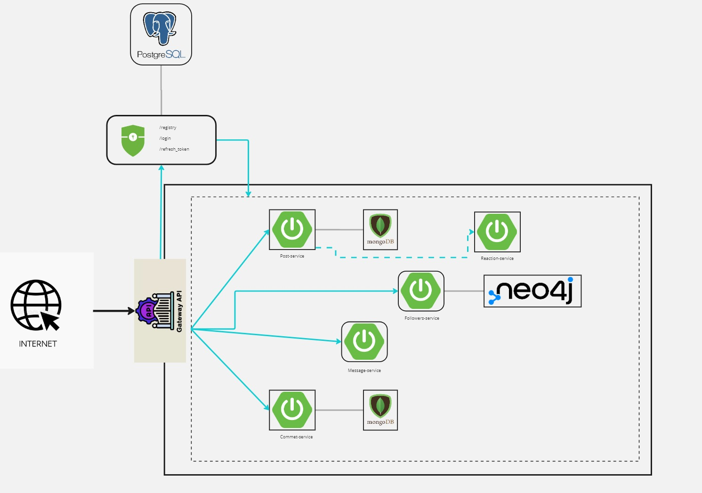

<h1 align="center">Hola 👋, soy Elias</h1>
<h3 align="center">Un apasionado de la tecnologia, cree este proyecto para poner mis habilidades a prueba y seguir afianzando mis conocimientos.</h3>

<h1 align="center">El proyecto</h1>
<h3 align="center">Demo de Red Social con arquitectura de microservicio reactivo (status: en proceso)</h3>

> Un vistazo a la arquitectura del proyecto

> Este repositorio contiene un proyecto demostrativo de una simulacion de red social en el cual he tratado de colocar todos mis conocimientos e incluyendo conocimientos que estoy 
> aprendiendo a lo largo de este desarrollo.

# Indice
- [Primeros Pasos](#primeros-pasos)
  - [Pre-requisitos](#pre-requisitos)
  - [Instalacion](#instalacion)
- [Servicios del Proyecto](#servicios-del-proyecto)
  - [Business domain](#business-domain)
    - [Commet-service](#commet-service)
    - [Post-service](#post-service)
  - [Infraestructure](#infraestructure)
- [Contributing](#contributing)
- [License](#license)

# Primeros pasos
Siga las siguientes instrucciones para configurar correctamente el proyecto en su máquina local.
* ## Pre requisitos
Tener instalado las siguientes herramientas:

* Java Development Kit (JDK) 17 o posterior
* Maven
* Git
* Docker (opcional sino tener instaladas las siguientes bd)
  * MongoDB
  * Postgresql
  * neo4j
* ## Instalacion
1. Clonar el repositorio:  
git clone https://github.com/ZenyCero/TwitterClone.git
2. Navegar a la raiz del proyecto
3. Compilar y empaquetar: mvn clean install
# Servicios del proyecto
### Business domain:  
Descripcion: servicios que contienen la logica de negocio
### Commet Service:
**Descripcion:**  
Servicio que se encarga de la gestion de los comentarios 

**Caracteristicas:**
  * Guardar comentario
  * Obtener todos los comentarios asociados a un post  
  
**Endpoints del api:**  
Obtener todos los comentarios asociados a un post.  
- Endpoint: http://localhost:8080/commet/{id}  
- Response:`{"idPost": "number","content":"string","created":"Date","updated":"Date"}`

**Configuracion:**  
Variables de entorno
- `server.port`: establece el puerto de despliegue del servicio
- `spring.application.name`: establece el nombre de la aplicacion
- `spring.data.mongodb`:
  - `uri`: cadena de conexion a la db mongo 
  - `username`: establece el usuario de conexion a la db mongo
  - `password`: establece el password de conexion a la db mongo
    
**Depedencias:**
- spring-boot-starter-webflux
- spring-boot-starter-data-mongodb-reactive
- shared-library: libreria compartida creada para gestionar las excepciones, validaciones y casting
- spring-starter-netflix-eureka-client

**Manejo de Errores**
- `400 Bad Request`: entrada invalida

### Post Service:  
servicio encargado de gestionar los post

### infraestructure: servicios que ayudan a la arquitectura del proyecto

